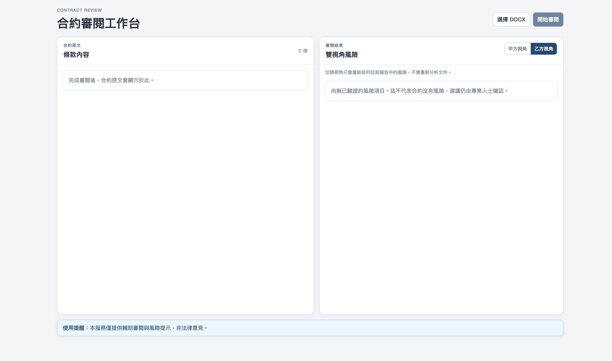
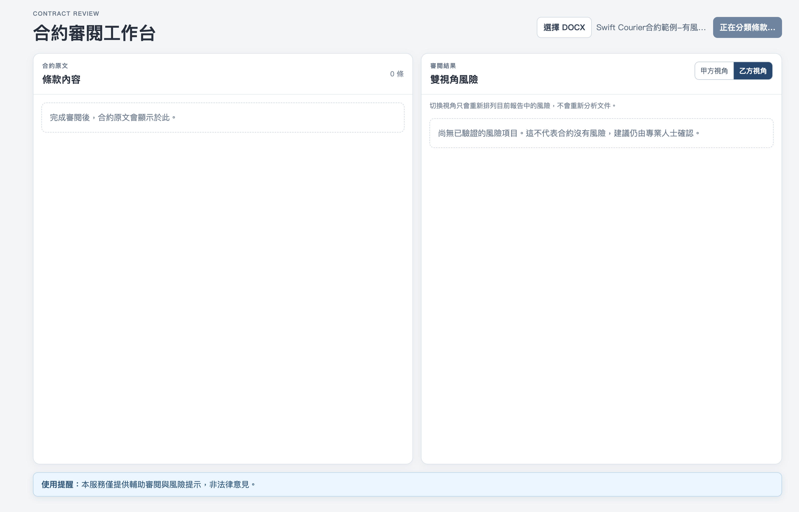
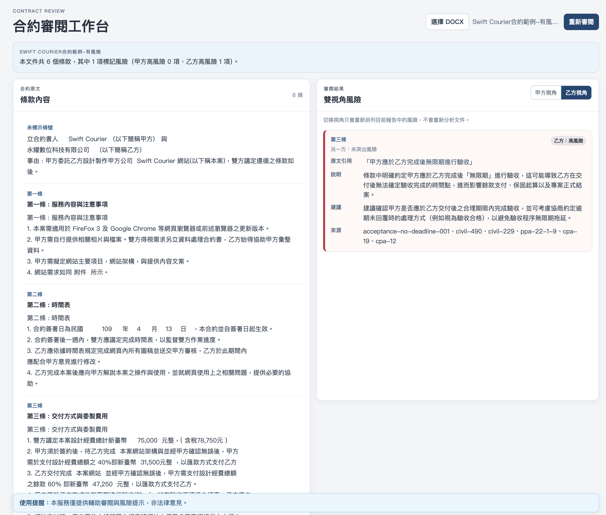
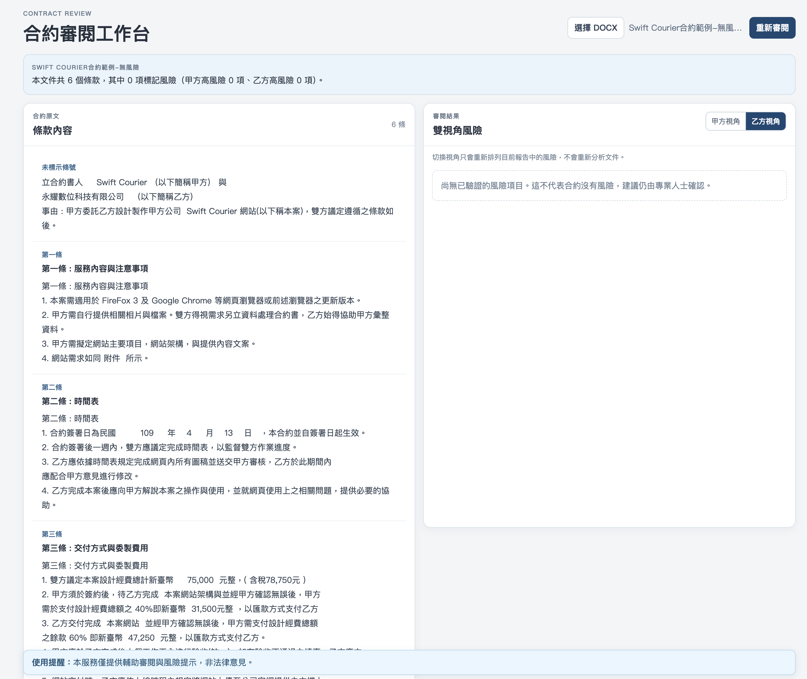

# 合約審閱助手（Contract Review Assistant）

針對「軟體開發／系統委外承攬合約」的審閱助手。使用者上傳 `.docx` 合約草稿，系統將條款結構化、
產生白話摘要，並同時以**甲方（業主）**與**乙方（接案方／開發商）**雙視角呈現風險分級、原因與建議。

> 本服務僅提供輔助審閱與風險提示，**非法律意見**。完整產品原則與範圍見
> [docs/DEVELOPMENT_SPEC.md](docs/DEVELOPMENT_SPEC.md)。

## 技術棧

```text
frontend/  Vue 3 + Vite + TypeScript + Pinia + Vue Router
backend/   Python 3.12 + FastAPI + Pydantic v2
llm/       Ollama Cloud（gemma4:31b-cloud，分類／風險評估／judge gate）
           本機 Ollama（qwen3-embedding:0.6b，legal_sources RAG 檢索用，見下方「RAG／embedding」）
data/      風險規則庫（risk_rules.seed.json）＋ 法規知識庫（legal_sources.seed.json + embeddings.npz）
```

MVP 階段後端資料為 in-memory／本機檔案系統，尚未接資料庫；詳見
[docs/SDD_ARCHITECTURE.md](docs/SDD_ARCHITECTURE.md) 的分層架構與依賴規則。

## 快速開始

### 後端

```bash
cd backend
uv sync
cp ../.env.example ../.env   # 填入 OLLAMA_API_KEY 才能跑 classify／review
uv run uvicorn app.main:app --reload --port 8000
```

### 前端

```bash
cd frontend
npm install
npm run dev -- --port 5173
```

開發模式下前端已在 `vite.config.ts` 設定 `/api` proxy 轉發到 `http://127.0.0.1:8000`
（可用 `VITE_DEV_API_PROXY_TARGET` 覆寫），不需另外處理 CORS。正式環境改由
`VITE_API_BASE_URL` 指定後端網址（預設同源 `/api`）。

瀏覽 <http://localhost:5173> 上傳 `.docx` 即可跑完整 parse → classify → review 流程。

### 操作流程

以下依實際操作順序截圖，用同一份範例合約分別示範「有風險」與「無風險」兩種結果（範例合約已去識別化，見
下方「本機手動測試範例」）：

**1. 初始畫面** — 左側「合約原文」、右側「雙視角風險」皆為空，等待上傳 `.docx`。



**2. 送出後依序呼叫 upload → parse → classify → review** — 按鈕依序顯示各階段處理中狀態（此圖為「正在分類
條款」）；此步驟含多次 LLM 呼叫（分類、風險評估、judge gate），依規則命中數量可能需要數秒到數十秒。



**3. 有風險範例的結果** — 條款內容含「無限期進行驗收」，命中 `acceptance-no-deadline-001` 規則：左側顯示
完整條款原文，右側依風險等級列出風險卡片（條號、原文引用、說明、建議、來源——風險規則 ID ＋ 檢索到的法
規 `knowledge_id`）。



**4. 無風險對照組的結果** — 同一份合約，把「無限期」改成「十個工作天內」後重新跑一次，風險卡片消失，
`0 項標記風險`。兩份範例的差異只有這一句話，方便對照規則到底抓到了什麼。



甲乙雙方視角可用右上角「甲方視角／乙方視角」切換；切換**不會**重新呼叫後端分析，純前端重新排序／顯示既
有報告（見 `docs/SDD_ARCHITECTURE.md` §5 前端狀態原則）。

### RAG／embedding（選用）

`data/legal_sources.seed.json`（法規知識庫）的檢索需要本機另外跑一個 embedding 模型；**未設定時系統會自動
優雅降級**（`NullKnowledgeRepository`，等同無 RAG 依據），`review` 其餘功能不受影響，可跳過此節。

```bash
brew install ollama
brew services start ollama
ollama pull qwen3-embedding:0.6b

# .env 另外加上：
# OLLAMA_EMBEDDING_MODEL=qwen3-embedding:0.6b
# OLLAMA_EMBEDDING_BASE_URL=http://localhost:11434

cd backend
uv run python scripts/build_legal_sources_index.py   # 產生 data/legal_sources.embeddings.npz
```

### 測試

```bash
cd backend && uv run pytest
cd frontend && npm test -- --run
```

### 本機手動測試範例

想快速看到「有風險」與「無風險」畫面的差異，而不想自己動手改合約內容，可以參考
`specs/003-dual-perspective-risk-review/fixtures/README.md` 的手動驗證步驟（暫時用測試用
`reviewed_test_rules.json` 覆蓋正式規則檔）。

若手邊剛好有一份真實合約想拿來做示範素材，流程建議：

1. 先用去識別化工具或人工方式，把公司全名、統一編號、負責人姓名、地址、電話**以及文件內嵌的印章圖片**
   （`.docx` 解壓後常藏在 `word/media/`，純文字比對抓不到）都換成虛構內容——這是本專案唯一允許放進本機測試
   的合約來源方式；真實內容一律不得進版控（見 `specs/*/fixtures/README.md`）。
2. 複製一份，刻意保留（或加入）會命中某條 `reviewed` 風險規則的字句，作為「有風險」範例。
3. 再複製一份，把該字句改成規則 `suggestion_template` 建議的寫法（例如把「無限期進行驗收」改成「十個工作
   天內進行驗收」），跑一次應得到 0 筆風險，作為「無風險」對照組。
4. 兩份檔案放在 repo 根目錄即可——`.gitignore` 的 `/*.docx` 規則會自動排除，不會誤進版控。

## 專案狀態（依 spec 編號）

| Spec | 說明 | 狀態 |
|---|---|---|
| [001](specs/001-docx-clause-extraction/) | DOCX 條款抽取 | 完成 |
| [002](specs/002-llm-clause-classification/) | LLM 條款分類與白話摘要 | 完成 |
| [003](specs/003-dual-perspective-risk-review/) | 雙視角風險規則與 Evidence 驗證 | 完成 |
| [004](specs/004-frontend-review-workbench/) | Vue 合約審閱工作台（前端） | 完成 |
| [005](specs/005-rag-and-judge-gate/) | RAG 知識檢索與 Judge Gate | 實作完成，待覆核 |

詳細變更歷史見 [CHANGELOG.md](CHANGELOG.md)。

## 已知限制

- **正式風險規則庫（`data/risk_rules.seed.json`）33 筆中僅 1 筆（`acceptance-no-deadline-001`）已審核為
  `reviewed`**，其餘 32 筆仍是 `status: draft`，需使用者人工審核並改為 `reviewed` 後，`POST /review` 才會
  針對正式資料產生風險輸出（刻意的安全預設）。手動驗證用的已審核規則集在
  `specs/003-dual-perspective-risk-review/fixtures/reviewed_test_rules.json`。審核方式：直接編輯規則的
  `status` 欄位，目前無管理介面。
- **`data/legal_sources.seed.json`（法規知識庫）15 筆已全數審核為 `reviewed`**，但其中消保法／政府採購法
  4 筆的適用性（是否適用於一般 B2B 委外合約）仍待評估，見 `specs/005-rag-and-judge-gate/spec.md`。
- 僅支援 `.docx`；不支援 PDF、掃描檔、`.doc` 舊格式，偵測到 Track Changes 會直接拒絕上傳。
- 後端 MVP 為 in-memory repository，重新啟動後已上傳的 `document_id` 即失效。
- 風險規則比對（`risk_rules`）為決定性的 `clause_types` + `trigger_patterns` 子字串比對，非向量檢索；
  `legal_sources` 的檢索則是真正的 embedding 向量檢索（本機 Ollama，見上方「RAG／embedding」），兩者是互補
  的兩層，不是同一套機制。

各 spec 目錄下的 `spec.md`「已知限制」段落有更完整、逐一功能的細節。

## 開發流程

本專案採 Spec-Driven Development（SDD）：每個 feature 先有 `spec.md` → `design.md` → `contracts/`
→ `tasks.md`，才進入實作與測試。規則與目錄慣例見 [specs/README.md](specs/README.md)。
