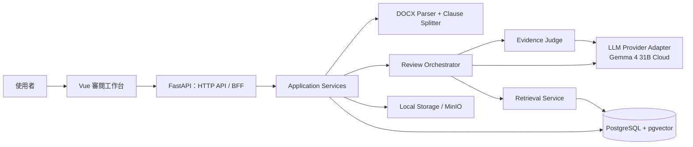

# SDD 架構文件：軟體開發合約審閱助手

> SDD 在本專案指 **Spec-Driven Development（規格驅動開發）**。  
> 原則：規格是實作、測試與驗收的唯一共同依據；不得先寫功能、後補需求。

本文件需與 [DEVELOPMENT_SPEC.md](./DEVELOPMENT_SPEC.md) 一起閱讀：前者定義系統的開發方法與架構，後者定義產品需求與限制。

## 1. SDD 工作規則

每項可交付功能必須依序產出以下 artefacts，未完成前一項不可進入下一項：

```text
需求規格（spec.md）
  → 技術設計（design.md）
  → API / schema 契約（contracts/）
  → 可驗收工作清單（tasks.md）
  → 實作
  → 自動化測試 + 驗收紀錄
```

### Definition of Ready

任一 feature 可開始實作前，必須已明確定義：

- 使用者目標、範圍與非範圍。
- 輸入、輸出、錯誤情境與資料權限。
- 來源資料是否包含合約原文，及其留存／刪除方式。
- 介面契約、Pydantic schema 或資料庫 migration 的影響。
- 可驗收條件與測試樣本。

### Definition of Done

- 所有 acceptance criteria 均有對應的 automated test 或可重現驗收步驟。
- API 與 schema 已更新且前後端契約一致。
- 所有 LLM 輸出均完成 Pydantic、evidence 與 source reference 驗證。
- 不在 log、測試快照或錯誤訊息中留下合約原文。
- 安全、刪除與失敗情境符合 feature spec。

## 2. 專案目錄與規格目錄

```text
contract-review/
├── docs/
│   ├── DEVELOPMENT_SPEC.md       # 產品開發規格
│   └── SDD_ARCHITECTURE.md       # 本文件：架構與 SDD 流程
├── specs/
│   ├── README.md                 # spec 編號與撰寫規則
│   └── 001-docx-clause-extraction/
│       ├── spec.md
│       ├── design.md
│       ├── tasks.md
│       ├── contracts/
│       │   └── clause.schema.json
│       └── fixtures/
│           └── README.md
├── frontend/
├── backend/
├── data/
└── docker-compose.yml
```

規格以遞增編號命名，例如 `002-llm-clause-classification`、`003-dual-perspective-risk-review`。一個 spec 應可獨立驗收，避免建立「整個產品」這種過大 feature。

## 3. 系統總體架構



系統採取「模組化單體（modular monolith）」：前後端可分開部署，但後端 MVP 不拆微服務。這讓本地開發、測試、資料交易與未來部署都維持低複雜度。

## 4. 後端分層架構

後端採取依賴向內的四層結構；外層不得把框架或模型供應商細節滲入核心規則。

```text
HTTP/API → Application → Domain ← Infrastructure
```

| 層 | 位置 | 責任 | 禁止事項 |
|---|---|---|---|
| Interface | `app/api/` | FastAPI routes、request auth、HTTP error mapping | 不寫條款切分或 LLM prompt |
| Application | `app/services/` | 用例編排、transaction、狀態機、呼叫 domain port | 不直接使用 ORM 或 Ollama SDK |
| Domain | `app/domain/` | Clause、Risk、Evidence 規則、驗證、枚舉 | 不依賴 FastAPI、SQLAlchemy、HTTP |
| Infrastructure | `app/infrastructure/` | PostgreSQL repository、DOCX 檔案存取、Ollama adapter、向量查詢 | 不包含產品決策 |

### 後端建議結構

```text
backend/app/
├── api/
│   ├── routes_documents.py
│   ├── routes_reviews.py
│   └── dependencies.py
├── application/
│   ├── commands/
│   │   ├── upload_document.py
│   │   ├── parse_document.py
│   │   └── start_review.py
│   ├── queries/
│   │   ├── get_document.py
│   │   └── get_review_report.py
│   └── ports/
│       ├── document_repository.py
│       ├── file_storage.py
│       ├── llm_provider.py
│       └── knowledge_repository.py
├── domain/
│   ├── entities/
│   ├── services/
│   │   ├── clause_splitter.py
│   │   ├── evidence_validator.py
│   │   └── risk_ranker.py
│   └── schemas/
├── infrastructure/
│   ├── db/
│   ├── docx/
│   ├── llm/
│   ├── retrieval/
│   └── storage/
└── main.py
```

### 依賴規則

- `domain` 不可 import `application`、`infrastructure` 或 `api`。
- `application` 只能依賴 domain 與其宣告的 ports。
- `infrastructure` 實作 application ports。
- API 僅呼叫 application command/query。
- LLM prompt 屬於 infrastructure adapter；輸入／輸出 schema 屬於 domain。

## 5. 前端架構

前端採 Vue 3 feature-based structure；UI component 不應直接呼叫 `fetch`，所有 API 交由 service 層管理。

```text
frontend/src/
├── features/
│   └── contract-review/
│       ├── components/
│       │   ├── ContractDocumentPane.vue
│       │   ├── RiskPanel.vue
│       │   ├── RiskCard.vue
│       │   └── PerspectiveToggle.vue
│       ├── review.store.ts
│       ├── review.api.ts
│       ├── review.types.ts
│       └── ReviewPage.vue
├── shared/
│   ├── components/
│   ├── api/
│   └── utils/
├── router/
└── main.ts
```

### 前端狀態原則

- Server state：文件、條款、ReviewReport；由 `review.api.ts` 讀取並存入 Pinia。
- UI state：選定視角、選定條款、風險篩選、目前高亮 clause；僅存前端。
- `selectedPerspective` 切換時，只以 `risk_for_client` 或 `risk_for_vendor` 選擇排序與顯示，**不可呼叫 review API**。
- 所有原文以後端保存的 `original_text` 顯示；前端不得自行重組或截斷成可當作法律事實的內容。

## 6. 重要領域模型與狀態機

### Document aggregate

```text
uploaded → parsing → parsed → reviewing → completed
                    ↘ failed       ↘ failed
```

- 只有 `parsed` 或 `completed` 文件可以讀取條款。
- 只有 `parsed` 文件可開始 review。
- `completed` 文件如要重審，須建立新的 `review_run_id`，保留原結果以利追蹤。
- `failed` 必須保存不含原文的 machine-readable error code。

### 不可變資料與可再生資料

| 類型 | 範例 | 處理方式 |
|---|---|---|
| 不可變輸入 | 上傳 DOCX snapshot、原始段落順序 | 保存 version 與 checksum |
| 可再生資料 | 條款切分、embedding、LLM 摘要與風險 | 保存產生時間、模型與 prompt version，可重建 |
| 知識資料 | 風險規則、法規 | 保存知識版本與審核狀態 |

每一份審閱報告必須記錄：`parser_version`、`model_id`、`prompt_version`、`knowledge_base_version`、`created_at`。

## 7. SDD 契約設計

### API 契約

- OpenAPI 由 FastAPI 輸出，並在 `specs/<feature>/contracts/` 保留經確認的 request／response 範例。
- Breaking change 必須提高 API version 或建立 migration 計畫。
- HTTP 層不直接回傳 ORM entity；一律回傳 Pydantic response model。

### LLM 契約

LLM 的輸出不是可信任資料，必須經歷：

```text
JSON parse → Pydantic validation → evidence substring validation
→ source ID allow-list validation → judge gate → persistence
```

若任一步失敗，結果不可寫入正式 `ReviewReport`。可儲存經過遮罩的 technical error 供除錯，但不得保存合約原文。

### RAG 契約

Retrieval service 的輸入與輸出應固定：

```python
class RetrievalQuery(BaseModel):
    clause_type: ClauseType
    query_text: str
    jurisdiction: str = "TW"
    top_k: int = 5


class RetrievedKnowledge(BaseModel):
    knowledge_id: str
    parent_id: str | None
    title: str
    content: str
    source_url: str | None
    effective_date: date | None
    version: int
```

LLM 只能引用這些 `knowledge_id`，後端再把它們轉成安全的來源顯示資料。

## 8. Feature Spec 模板

每個 `specs/<id>-<feature>/spec.md` 至少包含：

```md
# <Feature 名稱>

## Goal
使用者要完成什麼工作？

## In scope / Out of scope

## User scenarios
- Given ... When ... Then ...

## Functional requirements

## Non-functional requirements
安全、效能、資料留存、可觀測性。

## Data contract
輸入、輸出、schema、版本與 migration。

## Failure handling

## Acceptance criteria
可自動化驗證的條件。
```

`design.md` 必須補上：模組責任、序列圖、資料表／migration、API、測試策略、風險及回滾方式。`tasks.md` 必須是可獨立提交與驗證的工作項目。

## 9. 第一個 SDD Feature：DOCX 條款抽取

建立 `specs/001-docx-clause-extraction/`，其範圍嚴格限制如下：

### Goal

使用者上傳繁中 `.docx` 軟體開發合約後，系統能保留原文順序並回傳結構化條款清單。

### In scope

- DOCX MIME／副檔名驗證。
- 讀取正文段落與表格文字。
- 常見繁中條號階層的辨識與條款切分。
- `clause_id`、位置、原文與 `other` 預設分類的 JSON 回傳。
- 三份不含真實機密的 fixture 合約。

### Out of scope

- LLM 分類、摘要、RAG、風險評估。
- PDF、OCR、Track Changes 實際解析。
- 登入、多租戶、雲端儲存。

### Acceptance criteria

1. 含表格的 fixture 文件，其儲存格文字在輸出中可找到。
2. 每個輸出的 `clause_id` 唯一且可定位到至少一個 `paragraph_id` 或 `table_ref`。
3. 條款的合併原文順序與 DOCX 顯示順序一致。
4. 無法辨識條號的文字不得遺失，必須建立 `unstructured-*` clause。
5. 同一 fixture 重複解析，輸出條款順序與 ID 穩定。

## 10. 測試金字塔

| 類型 | 目標 | 範例 |
|---|---|---|
| Unit | 驗證純規則與 deterministic code | 條號 regex、evidence substring、risk sorting |
| Contract | 維持模組與 API 相容性 | Pydantic schema、OpenAPI response、LLM fake provider |
| Integration | 驗證真實 adapter 的組合 | DOCX fixture → clauses、Postgres repository |
| E2E | 驗證使用者工作流 | 上傳 → 完成 → 切換視角 → 跳至條款 |
| Eval | 驗證 LLM 品質與安全 | 黃金合約集的分類正確率、無依據風險率 |

模型評估集不得使用真實客戶合約，除非已取得明確授權並完成去識別化。LLM feature 上線前，至少要有固定 golden set、目標指標與回歸測試。

## 11. 建議實作順序

```text
001 DOCX 條款抽取
  → 002 條款分類與摘要
  → 003 雙視角風險規則與 evidence 驗證
  → 004 Vue 審閱工作台
  → 005 RAG 與 judge gate
  → 006 非同步任務、資料刪除與容器化
```

每完成一個 spec，先更新其驗收紀錄與 README，再開始下一個 spec。不得因為後續功能需要而跳過目前 feature 的測試。

## 12. 接手 Codex 的執行指令

接手開發時，優先閱讀：

1. `docs/DEVELOPMENT_SPEC.md`
2. `docs/SDD_ARCHITECTURE.md`
3. 當前要實作的 `specs/<feature>/spec.md`、`design.md`、`tasks.md`

如目標 feature 尚未建立 spec，先撰寫並請使用者確認範圍；不要直接開始寫產品程式碼。任何與既有 spec 相衝突的需求，先更新 spec 與契約，再修改實作。
