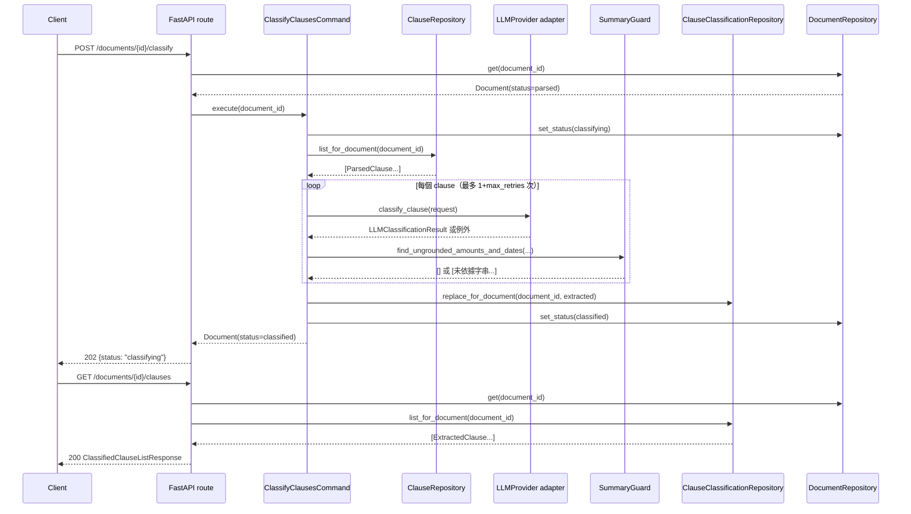

# 002：條款分類與白話摘要技術設計

## 模組責任

```text
API route (routes_classification.py)
  → ClassifyClausesCommand
      → DocumentRepository（讀取／更新狀態）
      → ClauseRepository（讀取 001 產出的 ParsedClause）
      → LLMProvider port（呼叫 LLM，逐 clause 分類）
      → SummaryGuard（domain：金額／日期防呆比對）
      → ClauseClassificationRepository（寫入 ExtractedClause）

GET /clauses（沿用 001 路由，query 改為依 status 分派）
  → GetClausesQuery
      → status == parsed  → 讀 ClauseRepository，回傳 001 既有形狀
      → status == classified → 讀 ClauseClassificationRepository，回傳完整 ExtractedClause
```

沿用 SDD_ARCHITECTURE.md 的依賴規則：`domain` 不 import `application`／`infrastructure`／`api`；
LLM SDK（`langchain_ollama`）只存在於 `app/infrastructure/llm/`。

## 資料結構

### `ClauseType`（新增，`app/domain/schemas/clause_type.py`）

沿用 `docs/DEVELOPMENT_SPEC.md` §7 的機器值：

```python
class ClauseType(str, Enum):
    SCOPE = "scope"
    ACCEPTANCE = "acceptance"
    PAYMENT = "payment"
    IP = "ip"
    WARRANTY = "warranty"
    LIABILITY = "liability"
    TERMINATION = "termination"
    PENALTY = "penalty"
    CONFIDENTIALITY = "confidentiality"
    OTHER = "other"
```

`app/domain/schemas/clause.py` 的 `ParsedClause.clause_type` 維持 `Literal["other"]`（001 不變）；
`ClauseType` 只給 002 之後的 schema 使用，避免動到 001 已驗收的 contract。

### `ExtractedClause`（新增，`app/domain/schemas/extracted_clause.py`）

以 `docs/DEVELOPMENT_SPEC.md` §7 的 `ExtractedClause` 為基礎，額外加兩個欄位（provenance／人工確認旗標；
不影響既有欄位語意，向前相容 003 直接沿用本 schema）：

```python
class ExtractedClause(BaseModel):
    clause_id: str = Field(min_length=1)
    clause_type: ClauseType
    original_text: str = Field(min_length=1)
    location: ClauseLocation
    plain_summary: str
    confidence: float = Field(ge=0, le=1)
    requires_human_review: bool = False   # 新增：重試後仍失敗時設為 True
    model_id: str | None = None           # 新增：紀錄實際使用的模型（SDD_ARCHITECTURE §6 provenance 要求）
```

`clause_id`、`original_text`、`location` 必須逐一複製自對應的 `ParsedClause`（001 輸出），不可由本 feature 重新產生。

### LLM 呼叫的請求／回應 schema（`app/domain/schemas/llm_classification.py`）

```python
class LLMClassificationRequest(BaseModel):
    clause_id: str
    original_text: str = Field(min_length=1)


class LLMClassificationResult(BaseModel):
    clause_id: str
    clause_type: ClauseType
    plain_summary: str = Field(min_length=1)
    confidence: float = Field(ge=0, le=1)
```

這兩個 schema 放在 `domain`，因為它們描述的是「業務要求的 LLM 輸出結構」，與供應商無關；
`application` 的 port 依賴它們，`infrastructure` adapter 負責把供應商原始回應轉成這個結構。

## LLM Provider Port 與 Adapter

### Port（`app/application/ports/llm_provider.py`）

```python
class LLMProvider(Protocol):
    model_id: str

    def classify_clause(self, request: LLMClassificationRequest) -> LLMClassificationResult: ...
```

- 呼叫失敗時，adapter 必須拋出下列兩種明確區分的例外之一（新增於 `app/domain/errors.py`）：
  - `LLMOutputInvalidError`：JSON 解析失敗、Pydantic 驗證失敗、或供應商回傳明確的「拒答／不知道」。屬於
    **可重試** 錯誤。
  - `LLMProviderUnavailableError`：逾時、連線失敗、認證失敗（如 `OLLAMA_API_KEY` 無效）、非預期的
    HTTP 5xx。屬於 **不可重試、整份文件失敗** 錯誤（error_code = `LLM_PROVIDER_UNAVAILABLE`）。

### Adapter（`app/infrastructure/llm/ollama_provider.py`）

- 使用 `langchain_ollama.ChatOllama`，設定值一律來自環境變數（見下方「設定」），不得寫死於程式碼。
- Prompt 只包含單一 clause 的 `original_text`、`ClauseType` enum 說明與輸出 JSON Schema 說明；不得夾帶其他
  clause 或文件內容（spec.md 功能需求 2）。
- 呼叫 `ChatOllama` 時設定逾時（預設 30 秒，對應 spec.md NFR）；逾時／連線例外一律包裝為
  `LLMProviderUnavailableError`。
- 收到回應後先嘗試 `json.loads` 再以 `LLMClassificationResult` 驗證；任何失敗都包裝為 `LLMOutputInvalidError`，
  並記錄「驗證失敗」（不記錄原文／回應內容）。

### 設定（`app/infrastructure/llm/config.py`）

```python
class LLMSettings(BaseSettings):
    ollama_api_key: str = Field(validation_alias="OLLAMA_API_KEY")
    ollama_base_url: str = Field(default="https://ollama.com", validation_alias="OLLAMA_BASE_URL")
    ollama_model: str = Field(default="gemma4:31b-cloud", validation_alias="OLLAMA_MODEL")
```

- 啟動時以 `python-dotenv` 讀取專案根目錄 `.env`（已在前置工作建立 `.env.example`）。
- `OLLAMA_API_KEY` 未設定時，`get_llm_provider()`（`app/api/dependencies.py` 新增）拋出設定錯誤並讓應用程式
  啟動失敗（fail fast），而不是靜默呼叫失敗的 provider。
- 新增依賴（`backend/pyproject.toml`）：`langchain-ollama`、`python-dotenv`、`pydantic-settings`。

## 白話摘要防呆（`app/domain/services/summary_guard.py`）

純 domain 邏輯，不依賴任何外部套件：

```python
def find_ungrounded_amounts_and_dates(original_text: str, plain_summary: str) -> list[str]:
    """回傳 plain_summary 中，比對 original_text 後找不到依據的金額／日期字串。
    空 list 代表通過防呆。"""
```

- 金額：正規表示式擷取（a）阿拉伯數字＋單位（`\d[\d,]*\s*(元|NT\$|%)`）、（b）中文數字金額
  （`[一二三四五六七八九十百千萬]+元`）。
- 日期：`\d{2,4}年\d{1,2}月\d{1,2}日`、`民國\d{1,3}年`、`\d{4}/\d{1,2}/\d{1,2}`。
- 逐一在 `original_text` 做子字串比對（全形／半形數字先正規化再比對，避免誤判）；找不到者列入回傳清單。
- `ClassifyClausesCommand` 呼叫此函式；回傳非空清單視同該次 LLM 輸出未通過驗證，觸發重試邏輯（與
  `LLMOutputInvalidError` 走同一條重試路徑）。

## 應用層流程（`app/application/commands/classify_clauses.py`）

```python
@dataclass
class ClassifyClausesCommand:
    document_repository: DocumentRepository
    clause_repository: ClauseRepository
    classification_repository: ClauseClassificationRepository
    llm_provider: LLMProvider
    max_retries: int = 1

    def execute(self, document_id: str) -> Document:
        document = self._require_ready_document(document_id)
        self.document_repository.set_status(document_id, DocumentStatus.CLASSIFYING)

        parsed_clauses = self.clause_repository.list_for_document(document_id)
        extracted: list[ExtractedClause] = []
        try:
            for clause in parsed_clauses:
                extracted.append(self._classify_one(clause))
        except LLMProviderUnavailableError as exc:
            self.document_repository.set_status(document_id, DocumentStatus.FAILED, exc.error_code)
            raise

        self.classification_repository.replace_for_document(document_id, extracted)
        self.document_repository.set_status(document_id, DocumentStatus.CLASSIFIED)
        return self.document_repository.get(document_id)

    def _classify_one(self, clause: ParsedClause) -> ExtractedClause:
        request = LLMClassificationRequest(clause_id=clause.clause_id, original_text=clause.original_text)
        for _ in range(self.max_retries + 1):
            try:
                result = self.llm_provider.classify_clause(request)
            except LLMOutputInvalidError:
                continue  # 用掉一次重試額度
            if not find_ungrounded_amounts_and_dates(clause.original_text, result.plain_summary):
                return self._to_extracted_clause(clause, result, requires_human_review=False)
        return self._fallback_clause(clause)

    def _fallback_clause(self, clause: ParsedClause) -> ExtractedClause:
        return ExtractedClause(
            clause_id=clause.clause_id,
            clause_type=ClauseType.OTHER,
            original_text=clause.original_text,
            location=clause.location,
            plain_summary="此條款目前無法可靠分析，建議人工確認。",
            confidence=0.0,
            requires_human_review=True,
            model_id=self.llm_provider.model_id,
        )
```

- `LLMProviderUnavailableError` 只在**單一 clause** 呼叫時發生就視為整份文件失敗並中止迴圈（spec.md 情境
  「LLM provider 整體無法連線」）；`LLMOutputInvalidError` 與摘要防呆失敗則只影響該 clause，不中止其他 clause。
- 重新呼叫 `POST /classify`（文件已是 `classified`）時，`_require_ready_document` 允許
  `status in {PARSED, CLASSIFIED}`，並整批覆寫 `classification_repository`（非增量更新）。

## Repository／Port 新增

```python
class ClauseClassificationRepository(Protocol):
    def replace_for_document(self, document_id: str, clauses: list[ExtractedClause]) -> None: ...
    def list_for_document(self, document_id: str) -> list[ExtractedClause]: ...
```

MVP 以 `InMemoryClauseClassificationRepository`（結構同 001 的 `InMemoryClauseRepository`）實作，獨立於
001 的 `ClauseRepository`，避免動到已驗收的儲存邏輯；006 換 PostgreSQL adapter 時兩者可各自對應一張表
（`clauses` / `extracted_clauses`，以 `clause_id` 關聯）。

## Document 狀態機（擴充 `app/domain/entities/document.py`）

```text
uploaded → parsing → parsed → classifying → classified
                    ↘ failed              ↘ failed
                                  ↖ classified → classifying（允許重新分類，覆寫結果）
```

`DocumentStatus` 新增 `CLASSIFYING`、`CLASSIFIED`。`completed`／`reviewing`（風險評估後的終態）留給 003 導入。

## API

### `POST /api/documents/{document_id}/classify`（新檔案 `app/api/routes_classification.py`）

- 前置檢查：`status ∈ {parsed, classified}`，否則 `409 DOCUMENT_NOT_READY`。
- 回應固定 `202 {document_id, status: "classifying"}`（比照 001 `/parse` 的字面契約慣例：即使本機 MVP
  同步執行完畢，回應仍回報處理中狀態；實際結果以 `GET /clauses` 查詢）。
- LLM provider 整體失敗時，本次 HTTP 呼叫直接回傳 `502 LLM_PROVIDER_UNAVAILABLE`（因為是同步執行、例外會
  往上傳到 route）。

### `GET /api/documents/{document_id}/clauses`（擴充 `GetClausesQuery`）

```python
def execute(self, document_id: str) -> ClauseListResponse | ClassifiedClauseListResponse:
    document = self._require_existing(document_id)
    if document.status in (UPLOADED, PARSING, CLASSIFYING):
        raise DocumentNotReadyError()
    if document.status == FAILED:
        raise error_for_code(document.error_code)
    if document.status == PARSED:
        return ClauseListResponse(...)          # 001 既有形狀，不變
    if document.status == CLASSIFIED:
        return ClassifiedClauseListResponse(...)  # 新形狀
```

`routes_documents.py` 的 `response_model` 改為 `ClauseListResponse | ClassifiedClauseListResponse`
（FastAPI 依實際回傳型別序列化）。新回應 schema 見
[contracts/extracted_clause.schema.json](./contracts/extracted_clause.schema.json)。

## 序列圖



## 測試策略

| 類型 | 目標 | 範例 |
|---|---|---|
| Unit | `SummaryGuard` 金額／日期比對正確性 | 摘要含原文沒有的金額 → 回傳非空清單；摘要金額逐字出現於原文 → 回傳空清單 |
| Unit | `ClassifyClausesCommand` 重試與 fallback 邏輯 | 以 `FakeLLMProvider`（依呼叫次序回傳 script 好的結果／例外）驗證：首次失敗、重試成功；兩次皆失敗 → `requires_human_review=True`；`LLMProviderUnavailableError` → 整份文件 `failed` 且不寫入 `classification_repository` |
| Integration | 001 三份 fixture 經 `FakeLLMProvider`（回傳固定但合理的分類）後，`ExtractedClause` 清單與 `ParsedClause` 的 `clause_id`／`location` 完全一致 | |
| API contract | `POST /classify` 狀態碼與 error code；`GET /clauses` 在 `parsed`／`classified` 兩種狀態下皆符合對應 JSON Schema | |
| Eval（輕量） | 人工覆核至少 10 個 clause 的分類與摘要（spec.md 驗收 2），記錄於 spec.md 驗收紀錄，不強制自動化 | |

`FakeLLMProvider` 放在 `backend/tests/fakes/fake_llm_provider.py`，只在測試中使用；CI 不呼叫真實 Ollama
服務。真正的 `OllamaProvider` adapter 只在本機、`OLLAMA_API_KEY` 存在時可選擇性手動驗證，不放進預設測試套件。

## 風險與回滾

- **風險：LLM 回應不穩定／變慢**。已用逾時＋重試一次＋fallback clause 降低影響；不因單一 clause 卡住整份文件。
- **風險：Ollama Cloud 費用／額度**。預設測試全走 `FakeLLMProvider`，真實呼叫僅發生在使用者主動觸發
  `POST /classify` 時。
- **風險：摘要防呆規則誤殺合理摘要**（例如摘要用不同數字格式重述原文金額）。設計為「找不到依據就重試，重試後仍
  找不到才 fallback」，而非直接拒絕整個分類；已知限制會寫入 spec.md 驗收紀錄，供 003/004 觀察實際誤判率再調整。
- **回滾方式**：002 的資料（`ExtractedClause`）存在獨立的 `ClauseClassificationRepository`，未覆寫 001 的
  `ClauseRepository`／`clauses` 資料。若需回滾，只要停止呼叫 `POST /classify`（或不部署本 feature 的路由），
  `GET /clauses` 會因為文件 `status` 仍停留在 `parsed` 而自動回退為 001 的既有行為，不需要資料遷移或刪除。

## 不確定事項與後續決策

- `confidence` 目前完全由 LLM 自報（成功時）或系統覆寫為 `0.0`（fallback 時）；是否需要依「重試次數」做更細緻的
  信心調整（例如重試成功但用了第 2 次嘗試 → confidence 打折），留待實際觀察 LLM 輸出品質後再議。
- `SummaryGuard` 的正規表示式清單為初版，涵蓋 spec.md 已確認的金額／日期樣式；契約編號、當事人名稱等其他實體
  防呆留待後續 feature 視誤判率決定是否加入。
