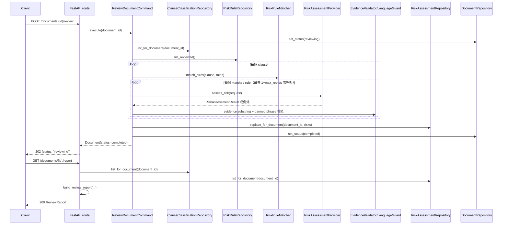

# 003：雙視角風險規則與 Evidence 驗證技術設計

## 模組責任

```text
POST /review (routes_review.py)
  → ReviewDocumentCommand
      → DocumentRepository（狀態檢查／更新）
      → ClauseClassificationRepository（讀 002 的 ExtractedClause）
      → RiskRuleRepository（讀 data/risk_rules.seed.json，僅 status=reviewed）
      → RiskRuleMatcher（domain：clause_type + trigger_patterns 比對，純 Python）
      → RiskAssessmentProvider port（每個 (clause, matched rule) 呼叫一次 LLM）
      → EvidenceValidator / ConservativeLanguageGuard（domain：確定性驗證）
      → RiskAssessmentRepository（寫入通過驗證的 RiskAssessment）

GET /report (routes_review.py)
  → GetReviewReportQuery
      → DocumentRepository、ClauseClassificationRepository、RiskAssessmentRepository
      → build_review_report()（domain：純 Python 組裝 ReviewReport，不呼叫 LLM）
```

沿用 SDD_ARCHITECTURE.md 的依賴規則；`langchain_ollama` 只存在於 `app/infrastructure/llm/`。

## 資料結構

### `RiskLevel`（新增，`app/domain/schemas/risk_level.py`）

```python
class RiskLevel(str, Enum):
    HIGH = "high"
    MEDIUM = "medium"
    LOW = "low"
    NONE = "none"
```

### `RiskRule`（新增，`app/domain/schemas/risk_rule.py`）

對應 `data/risk_rules.seed.json` 的欄位（`docs/DEVELOPMENT_SPEC.md` §8）：

```python
class RiskRule(BaseModel):
    id: str = Field(min_length=1)
    version: int
    jurisdiction: str
    clause_type: ClauseType
    topic: str
    trigger_patterns: list[str] = Field(min_length=1)
    risk_for_client: RiskLevel
    risk_for_vendor: RiskLevel
    risk_explanation: str
    review_questions: list[str] = []
    suggestion_template: str
    source_refs: list[str] = []
    status: Literal["draft", "reviewed"]
    updated_at: date
```

### `EvidenceRef`／`RiskAssessment`／`ReviewReport`（新增，`app/domain/schemas/risk_assessment.py`）

沿用 `docs/DEVELOPMENT_SPEC.md` §7 原始定義，不額外加欄位（與 002 對 `ExtractedClause` 加欄位不同，這裡
`requires_human_review` 已在官方 schema 中）：

```python
class EvidenceRef(BaseModel):
    clause_id: str
    quote: str = Field(min_length=1)
    rationale: str


class RiskAssessment(BaseModel):
    risk_id: str
    clause_id: str
    clause_type: ClauseType
    risk_for_client: RiskLevel
    risk_for_vendor: RiskLevel
    concern: str
    suggestion: str
    evidence: list[EvidenceRef] = Field(min_length=1)
    source_refs: list[str] = []
    confidence: float = Field(ge=0, le=1)
    requires_human_review: bool = False


class ReviewReport(BaseModel):
    document_id: str
    contract_title: str
    overall_summary: str
    disclaimer: str
    clauses: list[ExtractedClause]
    risks: list[RiskAssessment]
```

### LLM 任務 B 的請求／回應（新增，`app/domain/schemas/llm_risk_assessment.py`）

**設計決策：每次 LLM 呼叫只帶一條候選規則**（見「不確定事項」），讓重試／捨棄邏輯與 002 的
`ClassifyClausesCommand` 保持相同粒度與可測試性；`source_refs` 不讓 LLM 自己填，由 application 層依「這次
呼叫用了哪條規則」決定性地設定為 `[rule.id]`，因此不需要對 LLM 輸出做 allow-list 驗證（依構造即合法）。

```python
class RiskAssessmentRequest(BaseModel):
    clause_id: str
    clause_type: ClauseType
    original_text: str = Field(min_length=1)
    rule_id: str
    rule_topic: str
    rule_risk_explanation: str
    rule_review_questions: list[str]
    rule_suggestion_template: str


class LLMEvidenceItem(BaseModel):
    quote: str = Field(min_length=1)
    rationale: str


class RiskAssessmentResult(BaseModel):
    applicable: bool  # LLM 判斷 trigger_patterns 命中是否為誤觸發；False 時不產生風險
    risk_for_client: RiskLevel
    risk_for_vendor: RiskLevel
    concern: str
    suggestion: str
    evidence: list[LLMEvidenceItem] = []
    confidence: float = Field(ge=0, le=1)
```

## Domain 服務

### `RiskRuleMatcher`（`app/domain/services/risk_rule_matcher.py`）

```python
def match_rules(clause: ExtractedClause, rules: list[RiskRule]) -> list[RiskRule]:
    """純 Python、決定性；只比對 clause_type 相等的 reviewed 規則，
    trigger_patterns 任一子字串（正規化全形/半形後）出現在 original_text 即視為候選。
    不呼叫 LLM 或向量服務——真正的語意檢索留待 005。"""
```

`trigger_patterns` 命中只是「候選」，是否真的成立由 LLM 透過 `applicable` 欄位判斷（見上方 schema），避免
子字串誤觸發被當成確定風險。

### `ConservativeLanguageGuard`（`app/domain/services/conservative_language_guard.py`）

```python
_BANNED_PHRASES = ["本條無效", "一定會賠償", "保證勝訴", "絕對", "必然", "毫無疑問"]

def find_banned_phrase(text: str) -> str | None:
    """回傳命中的第一個斷言型詞語；None 代表通過（呼應 DEVELOPMENT_SPEC.md §2 原則 6：
    保守措辭，禁止斷言式結論）。"""
```

### `text_normalize`（重構，`app/domain/services/text_normalize.py`）

把 002 `summary_guard.py` 裡的 `_normalize`（NFKC 全半形正規化）抽成共用函式，`RiskRuleMatcher` 與
`summary_guard` 都改用它，避免邏輯漂移。

### `build_review_report`（`app/domain/services/review_report_builder.py`）

```python
_DISCLAIMER = "本服務僅提供輔助審閱與風險提示，非法律意見。"

def build_review_report(
    document: Document, clauses: list[ExtractedClause], risks: list[RiskAssessment]
) -> ReviewReport:
    """純 Python，不呼叫 LLM（FR10）。"""
    contract_title = Path(document.filename).stem
    high_client = sum(1 for r in risks if r.risk_for_client == RiskLevel.HIGH)
    high_vendor = sum(1 for r in risks if r.risk_for_vendor == RiskLevel.HIGH)
    overall_summary = (
        f"本文件共 {len(clauses)} 個條款，其中 {len(risks)} 項標記風險"
        f"（甲方高風險 {high_client} 項、乙方高風險 {high_vendor} 項）。"
    )
    return ReviewReport(
        document_id=document.document_id,
        contract_title=contract_title,
        overall_summary=overall_summary,
        disclaimer=_DISCLAIMER,
        clauses=clauses,
        risks=risks,
    )
```

`GET /report` 與 `POST /review` 都呼叫這個函式即時組裝，**不另外持久化 `ReviewReport` 物件**——
`clauses`／`risks` 各自的 repository 才是唯一資料來源，`ReviewReport` 是它們的一個確定性投影，避免多一份
需要保持同步的儲存狀態。

## Port 與 Adapter

### `RiskAssessmentProvider`（`app/application/ports/risk_assessment_provider.py`）

```python
class RiskAssessmentProvider(Protocol):
    model_id: str

    def assess_risk(self, request: RiskAssessmentRequest) -> RiskAssessmentResult:
        """例外語意與 002 的 LLMProvider 相同：LLMOutputInvalidError 可重試，
        LLMProviderUnavailableError 中止整份文件審閱。"""
        ...
```

### `OllamaRiskAssessmentProvider`（`app/infrastructure/llm/ollama_risk_provider.py`）

結構與 002 的 `OllamaClassificationProvider` 平行；例外分類（連線失敗 vs 輸出格式錯誤）邏輯重複度高，
抽成共用函式 `app/infrastructure/llm/exception_mapping.py`：

```python
def classify_llm_exception(exc: Exception) -> LLMOutputInvalidError | LLMProviderUnavailableError:
    ...
```

兩個 adapter 都呼叫 `raise classify_llm_exception(exc) from None`（沿用 002 的教訓：一律切斷 exception
chain，避免底層例外訊息夾帶合約原文流入 log，見 002 驗收紀錄）。

Prompt 規則（`_SYSTEM_PROMPT`）：只根據 `original_text` 與該筆規則的
`rule_topic`／`rule_risk_explanation`／`rule_review_questions`／`rule_suggestion_template` 作答；不得引用
其他規則或臆造原文未提及的事實；`applicable=false` 用於「這條規則其實不適用於這個條款」的情況；措辭比照
`docs/DEVELOPMENT_SPEC.md` §2 原則 6（可能有疑慮／建議確認／可考慮協商），不得使用斷言語氣。

### `RiskRuleRepository`（`app/application/ports/risk_rule_repository.py`）

```python
class RiskRuleRepository(Protocol):
    def list_reviewed(self, jurisdiction: str = "TW") -> list[RiskRule]: ...
```

`JsonRiskRuleRepository`（`app/infrastructure/repositories/json_risk_rule_repository.py`）：啟動時讀取
`data/risk_rules.seed.json`（repo 根目錄，與 `backend/` 平行），以 `RiskRule` 逐筆驗證；載入時發現不合法
的規則直接 fail fast（開發者自己維護的資料，不是使用者輸入，寧可及早發現）；`list_reviewed()` 回傳
`status == "reviewed"` 且 `jurisdiction` 相符的規則，過濾在 repository 層完成（`RiskRuleMatcher` 收到的
永遠已經是「可用」規則）。

### `RiskAssessmentRepository`（`app/application/ports/risk_assessment_repository.py`）

```python
class RiskAssessmentRepository(Protocol):
    def replace_for_document(self, document_id: str, risks: list[RiskAssessment]) -> None: ...
    def list_for_document(self, document_id: str) -> list[RiskAssessment]: ...
```

`InMemoryRiskAssessmentRepository` 比照 002 的 `InMemoryClauseClassificationRepository`，獨立於既有
repository，不動 001／002 資料。

## 應用層流程（`app/application/commands/review_document.py`）

```python
@dataclass
class ReviewDocumentCommand:
    document_repository: DocumentRepository
    classification_repository: ClauseClassificationRepository
    risk_rule_repository: RiskRuleRepository
    risk_assessment_repository: RiskAssessmentRepository
    risk_provider: RiskAssessmentProvider
    max_retries: int = 1

    def execute(self, document_id: str) -> Document:
        document = self._require_ready_document(document_id)  # status in {classified, completed}
        self.document_repository.set_status(document_id, DocumentStatus.REVIEWING)

        clauses = self.classification_repository.list_for_document(document_id)
        rules = self.risk_rule_repository.list_reviewed()

        risks: list[RiskAssessment] = []
        try:
            for clause in clauses:
                for rule in match_rules(clause, rules):
                    risk = self._assess_one(clause, rule, document.checksum)
                    if risk is not None:
                        risks.append(risk)
        except LLMProviderUnavailableError as exc:
            self.document_repository.set_status(document_id, DocumentStatus.FAILED, exc.error_code)
            raise

        self.risk_assessment_repository.replace_for_document(document_id, risks)
        self.document_repository.set_status(document_id, DocumentStatus.COMPLETED)
        return self.document_repository.get(document_id)

    def _assess_one(self, clause: ExtractedClause, rule: RiskRule, checksum: str) -> RiskAssessment | None:
        request = RiskAssessmentRequest(
            clause_id=clause.clause_id, clause_type=clause.clause_type, original_text=clause.original_text,
            rule_id=rule.id, rule_topic=rule.topic, rule_risk_explanation=rule.risk_explanation,
            rule_review_questions=rule.review_questions, rule_suggestion_template=rule.suggestion_template,
        )
        for _ in range(self.max_retries + 1):
            try:
                result = self.risk_provider.assess_risk(request)
            except LLMOutputInvalidError:
                continue
            if not result.applicable:
                return None  # LLM 判斷此規則其實不適用；非驗證失敗，不算「捨棄」
            if not all(e.quote in clause.original_text for e in result.evidence):
                continue
            if find_banned_phrase(result.concern) or find_banned_phrase(result.suggestion):
                continue
            return self._to_risk_assessment(clause, rule, result, checksum)
        return None  # 重試後仍未通過驗證：捨棄（spec.md FR8），不產生佔位風險

    def _to_risk_assessment(
        self, clause: ExtractedClause, rule: RiskRule, result: RiskAssessmentResult, checksum: str
    ) -> RiskAssessment:
        risk_id = sha256(f"{checksum}{clause.clause_id}{rule.id}".encode()).hexdigest()[:20]
        return RiskAssessment(
            risk_id=risk_id,
            clause_id=clause.clause_id,
            clause_type=clause.clause_type,
            risk_for_client=result.risk_for_client,
            risk_for_vendor=result.risk_for_vendor,
            concern=result.concern,
            suggestion=result.suggestion,
            evidence=[EvidenceRef(clause_id=clause.clause_id, quote=e.quote, rationale=e.rationale) for e in result.evidence],
            source_refs=[rule.id],  # 決定性設定，不信任 LLM 自填（見上方 schema 設計決策）
            confidence=result.confidence,
            requires_human_review=False,
        )
```

`LLMProviderUnavailableError` 只在單一 `(clause, rule)` 呼叫發生就中止整個迴圈並讓文件失敗（與 002 對
`LLMProviderUnavailableError` 的處理語意一致）。`LLMOutputInvalidError` 與驗證失敗（evidence／措辭）只影響
該筆風險，不中止其他組合的處理。

## GetReviewReportQuery（`app/application/queries/get_review_report.py`）

```python
def execute(self, document_id: str) -> ReviewReport:
    document = self._require_existing(document_id)
    if document.status == DocumentStatus.COMPLETED:
        clauses = self.classification_repository.list_for_document(document_id)
        risks = self.risk_assessment_repository.list_for_document(document_id)
        return build_review_report(document, clauses, risks)
    if document.status == DocumentStatus.FAILED:
        raise error_for_code(document.error_code)
    raise DocumentNotReadyError()
```

## 對既有程式碼的必要調整

- `GetClausesQuery`（002）：`GET /clauses` 目前只在 `status == CLASSIFIED` 時回傳完整分類形狀；本 feature
  把 `COMPLETED` 也視為「已分類」（審閱不會改變 clause 內容），需將判斷條件擴充為
  `status in (CLASSIFIED, COMPLETED)`，其餘分支不變。
- `DocumentStatus`（001/002）：新增 `REVIEWING`、`COMPLETED`。

## API

### `POST /api/documents/{document_id}/review`（新檔案 `app/api/routes_review.py`）

- 前置檢查：`status ∈ {classified, completed}`，否則 `409 DOCUMENT_NOT_READY`。
- 回應固定 `202 {document_id, status: "reviewing"}`（比照 001/002 的字面契約慣例）。
- `LLMProviderUnavailableError` 時直接回傳 `502`（同步執行、例外往上傳到 route）。

### `GET /api/documents/{document_id}/report`

- `status == completed` 時回傳 `200` + `ReviewReport`。
- 其餘未完成狀態 `409 DOCUMENT_NOT_READY`；`failed` 依既有 error_code 回傳對應狀態碼；不存在回傳 `404`。
- Schema 見 [contracts/review_report.schema.json](./contracts/review_report.schema.json)。

## 序列圖



## 測試策略

| 類型 | 目標 | 範例 |
|---|---|---|
| Unit | `RiskRuleMatcher` 只比對 reviewed／同 clause_type／trigger_patterns 命中 | `tests/unit/test_risk_rule_matcher.py` |
| Unit | `ConservativeLanguageGuard` 黑名單命中／不命中 | `tests/unit/test_conservative_language_guard.py` |
| Unit | `build_review_report` 決定性輸出（不需 LLM） | `tests/unit/test_review_report_builder.py` |
| Unit | `ReviewDocumentCommand` 以 `FakeRiskAssessmentProvider` 驗證：`applicable=false` 跳過、evidence 不在原文中重試後捨棄、措辭違規重試後捨棄、`LLMProviderUnavailableError` 整份文件失敗且不寫入 repository | `tests/unit/test_review_document_command.py` |
| Integration | 以測試用的小型 `reviewed` 規則集 + 002 fixture 的 `ExtractedClause`，經 `FakeRiskAssessmentProvider` 產生 `RiskAssessment`，驗證符合 `contracts/review_report.schema.json` | `tests/integration/test_review_fixture_flow.py` |
| API contract | `POST /review`／`GET /report` 狀態碼與 error code；`GET /clauses` 在 `completed` 狀態下仍回傳分類形狀 | `tests/api/test_review_api.py` |

`FakeRiskAssessmentProvider` 比照 002 的 `FakeLLMProvider`，放在 `backend/tests/fakes/`。

## 風險與回滾

- **風險：規則庫預設為空（全部 draft）**。刻意的安全預設；`RiskRuleMatcher` 對空規則集自然回傳零筆風險，
  不影響其他已完成 feature；`POST /review` 仍會成功執行並回傳「零風險」的合法報告。
- **風險：`(clause, rule)` 逐筆呼叫 LLM，規則量大時呼叫數量會隨 clause 數 × 命中規則數成長**。MVP 先求正確
  與可測試；若日後規則庫變大導致延遲/成本問題，可優化為單一 clause 一次呼叫、夾帶多筆候選規則（不改變
  `RiskAssessment` 對外契約，只影響 provider 呼叫方式），留待有實際效能數據後再做。
- **風險：保守措辭黑名單過嚴或過鬆**。以純 Python 清單管理，可依實際輸出快速調整，不需要改 LLM 呼叫邏輯。
- **回滾方式**：`RiskAssessmentRepository`／`RiskRuleRepository` 皆為獨立於 001/002 的新元件；不部署本
  feature 的路由即可完整回退，`GET /clauses` 在 `classified` 狀態下的行為不受影響。

## 不確定事項與後續決策

- 目前設計「每個 (clause, matched rule) 各一次 LLM 呼叫」，換取重試/捨棄邏輯的簡單與可測試性；若之後要優化
  成本，可改成單一 clause 攜帶多筆候選規則、一次呼叫回傳清單，此時 `source_refs` 驗證就需要真正的
  allow-list 檢查（目前因為呼叫粒度已經是單一規則，用「決定性設定」取代了驗證）。
- 保守措辭黑名單目前是初版靜態清單，未涵蓋所有可能斷言語氣；正式導入 005 的 judge gate 後，可視為第二層
  防護，兩者疊加而非互相取代。
- `RiskRule.updated_at` 目前只作紀錄用途，003 不實作規則版本歷史或失效日期邏輯。
