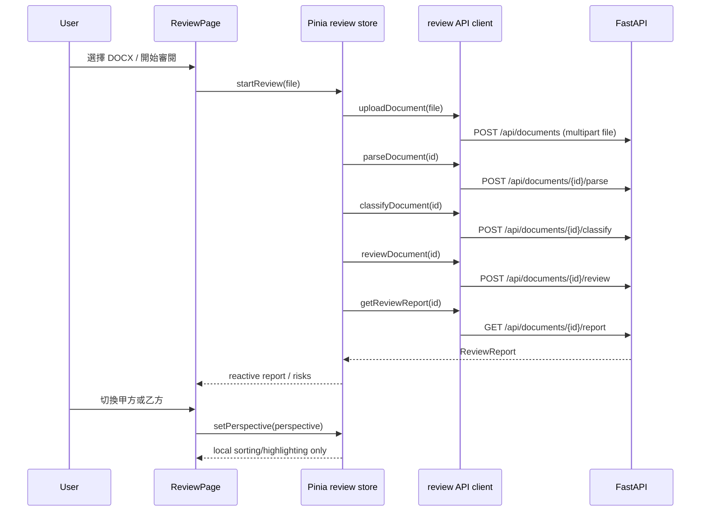

# 004：Vue 合約審閱工作台技術設計

## 模組責任

```text
ReviewPage.vue（composition / workflow UI）
  → useReviewStore（Pinia：server state + UI state）
      → review.api.ts（HTTP boundary）
          → shared/api/http.ts（fetch、錯誤轉換）
              → FastAPI existing routes

ReviewPage.vue
  ├── ContractDocumentPane.vue（只渲染後端 clauses 原文與高亮）
  ├── RiskPanel.vue（視角 toggle + 已排序風險清單）
  │   ├── PerspectiveToggle.vue（只 emit UI state）
  │   └── RiskCard.vue（風險所有可追溯欄位）
  └── DisclaimerBanner.vue（常駐免責聲明）
```

- `review.types.ts` 是與 001–003 Pydantic response 對齊的 TypeScript 邊界型別。
- `http.ts` 只處理 HTTP response、JSON 與 `ApiError`；不知道 contract-review domain。
- `review.api.ts` 是唯一知道 API path、payload 與 response shape 的 feature API layer。
- `review.store.ts` 編排工作流與保存 UI state；`setPerspective` 是同步純 state action，禁止呼叫 `reviewApi`。
- components 透過 props／events 呈現資料，不直接 import API client。

## 前端資料模型

```ts
type Perspective = 'client' | 'vendor'
type RiskLevel = 'high' | 'medium' | 'low' | 'none'

interface ReviewReport {
  document_id: string
  contract_title: string
  overall_summary: string
  disclaimer: string
  clauses: ExtractedClause[]
  risks: RiskAssessment[]
}
```

`RiskAssessment` 同時保存 `risk_for_client` 與 `risk_for_vendor`，與 003 contract 一致。Vue 不建立第二份結果，也不把其中一方風險覆寫到原資料。

## 視角排序與高亮規則

```text
selectedPerspective = vendor (default)
  → level = risk_for_vendor
  → order: high (3) > medium (2) > low (1) > none (0)

selectedPerspective = client
  → level = risk_for_client
  → 使用同一份 risks，以相同規則排序
```

排序 helper 是純函式，使用原 `risks` 的淺拷貝；相同等級以 `risk_id` 排序，結果穩定。高亮 CSS class 也只使用目前視角的 level。`setPerspective` 不讀取或寫入 server state，故從程式結構上保證不可能發送 request。

## 上傳與審閱序列



目前 API 的 POST routes 以 `202` 固定回報 processing status，但 backend MVP 同步執行 command；因此 workflow 隨即讀取 report。日後若改成真正 background job，僅在 API／store layer 加入 polling，不改變 components 或切換語意。

## API 與錯誤處理

完整 endpoint contract 見 [contracts/api.md](./contracts/api.md)。`ApiError` 保留 status、`error_code`、server `message`，由 store 轉成 UI 可顯示的 `errorMessage`。網路錯誤轉為固定繁中 message，不保留 request body 或檔案內容。

## 元件互動

- `RiskCard` emit `select`，由 `RiskPanel` 再 emit `selectClause` 給 `ReviewPage`；頁面呼叫 store `selectClause`，document pane 以 `selectedClauseId` 映射 `aria-current` 和 highlight class。
- `ContractDocumentPane` watch selection 後呼叫該 clause DOM element 的 `scrollIntoView`，沒有資料載入責任。
- `DisclaimerBanner` 使用固定產品文案；有 report 時可附帶顯示 server report 的 disclaimer，但固定 banner 不依賴 API 成功。

## 測試策略

| 類型 | 目標 | 檔案 |
|---|---|---|
| Unit | `sortRisksForPerspective` 選對欄位、穩定排序 | `review.store.spec.ts` |
| Unit | `setPerspective` 不呼叫 mocked API，且維持 report reference | `review.store.spec.ts` |
| Unit | API client 發送 multipart upload 與正確 path，非成功 response 轉為 `ApiError` | `review.api.spec.ts` |
| Component | RiskCard 顯示條號、level、quote、explanation、suggestion、source | `RiskCard.spec.ts` |
| Component | toggle emit 視角、固定免責聲明存在 | `ReviewPage.spec.ts` |

使用 Vitest + `@vue/test-utils` + jsdom；不使用含合約原文的 snapshot。mock API 回應只含短小去識別化字串。

## 風險與回滾

- **風險：現有路由與口語需求不同。** 現況沒有 `GET /api/documents/{id}` 與 `GET /api/clauses`。前端只使用實作已存在的 nested routes，細節固定在 API client／contract，避免散落在元件中。
- **風險：規則全為 draft 時零筆 risks。** RiskPanel 顯示「尚無已驗證的風險項目」，不把零筆結果稱作無法律風險。
- **風險：LLM workflow 時間長。** 顯示目前 workflow stage 並停用送出按鈕；未實作取消請求，因後端也沒有 cancellation contract。
- **回滾方式：** 前端完全是新增目錄；不部署／移除 `frontend/` 即可回滾，不影響後端或既有 specs。

## 不確定事項與決策

- 原始使用者需求列出的 `GET /api/documents/{id}`、`GET /api/clauses` 和 backend 實作矛盾。經檢查 route modules後，採用實際的 `GET /api/documents/{id}/clauses`；完整工作台以 `GET /report` 回傳的 clauses 呈現原文，無須額外 request。
- 甲方與乙方對應既有 API 的 `client` 與 `vendor` 欄位：`甲方 → risk_for_client`、`乙方 → risk_for_vendor`。
- 不為目前 API 新增輪詢。因 local MVP 的 POST commands 已同步完成；一旦後端真正非同步化，新增 polling 是 store／API 層的相容演進。
