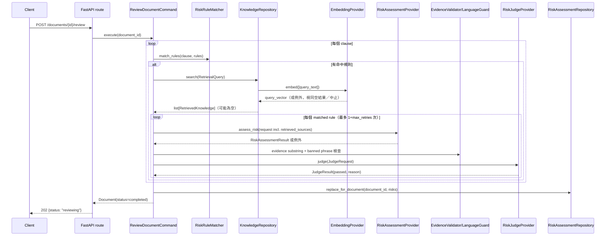

# 005：RAG 知識檢索與 Judge Gate 技術設計

## 模組責任

```text
POST /review (routes_review.py，端點不變)
  → ReviewDocumentCommand（擴充）
      → DocumentRepository（狀態檢查／更新，003 不變）
      → ClauseClassificationRepository（讀 002 的 ExtractedClause，003 不變）
      → RiskRuleRepository（讀 data/risk_rules.seed.json，003 不變）
      → RiskRuleMatcher（domain，003 不變：clause_type + trigger_patterns 比對）
      → KnowledgeRepository port（新增）── 每個「有命中規則」的 clause 呼叫一次 search()
          → LocalVectorKnowledgeRepository（infrastructure）
              → EmbeddingProvider port（新增）→ OllamaEmbeddingProvider（infrastructure）
              → rank_by_similarity()（domain，純函式：過濾＋cosine 排序＋top_k）
              → resolve_retrieved_knowledge()（domain，純函式：child→parent 展開）
      → RiskAssessmentProvider port（003，`RiskAssessmentRequest` 新增 `retrieved_sources` 欄位）
      → EvidenceValidator／ConservativeLanguageGuard（domain，003 不變）
      → RiskJudgeProvider port（新增）── 003 既有確定性驗證通過後才呼叫
          → OllamaRiskJudgeProvider（infrastructure）
      → RiskAssessmentRepository（003 不變，寫入通過驗證的 RiskAssessment）

離線（不在 API 執行流程中）:
backend/scripts/build_legal_sources_index.py
  → 讀 data/legal_sources.seed.json → EmbeddingProvider.embed() → 寫 data/legal_sources.embeddings.npz
```

沿用 `SDD_ARCHITECTURE.md` 的依賴規則；`langchain_ollama`／`numpy` 只存在於
`app/infrastructure/`；`rank_by_similarity`／`resolve_retrieved_knowledge` 是純 Python 的 domain 服務，不
import 任何 infrastructure。

## 資料結構

### `RetrievalQuery` / `RetrievedKnowledge`（新增，`app/domain/schemas/retrieval.py`）

完全比照 `docs/SDD_ARCHITECTURE.md` §7 既定欄位：

```python
class RetrievalQuery(BaseModel):
    clause_type: ClauseType
    query_text: str = Field(min_length=1)
    jurisdiction: str = "TW"
    top_k: int = Field(default=5, ge=1)


class RetrievedKnowledge(BaseModel):
    knowledge_id: str = Field(min_length=1)
    parent_id: str | None
    title: str = Field(min_length=1)
    content: str = Field(min_length=1)
    source_url: str | None
    effective_date: date | None
    version: int
```

### `LegalSource`（新增，`app/domain/schemas/legal_source.py`）

對應 `data/legal_sources.seed.json` 與 `contracts/legal_source.schema.json`，比照 003 `RiskRule` 的角色（
既是儲存格式，也是 `LocalVectorKnowledgeRepository` 內部的候選資料型別，**不對外回傳**——對外一律轉換成
`RetrievedKnowledge`，避免 `reviewed_by`／`corpus` 這類內部欄位外洩）：

```python
class LegalSource(BaseModel):
    knowledge_id: str = Field(min_length=1)
    corpus: Literal["legal_sources"]
    parent_id: str | None
    title: str = Field(min_length=1)
    source_title: str = Field(min_length=1)
    content: str = Field(min_length=1)
    clause_type: ClauseType | None
    jurisdiction: str
    source_url: str | None
    effective_date: date | None
    version: int
    status: Literal["draft", "reviewed"]
    reviewed_by: str | None
    updated_at: date
```

### `JudgeRequest` / `JudgeResult`（新增，`app/domain/schemas/judge.py`）

**設計決策**：`JudgeRequest` 只帶 judge 實際需要判斷的欄位，不直接內嵌整個 `RiskAssessmentResult`——
避免 judge 的輸入契約被動綁定 risk assessment 的內部形狀（例如 `applicable` 這個欄位對 judge 沒有意義，因
為 judge 只會在 `applicable=true` 且已通過確定性驗證後才被呼叫）：

```python
class JudgeRequest(BaseModel):
    clause_original_text: str = Field(min_length=1)
    risk_for_client: RiskLevel
    risk_for_vendor: RiskLevel
    concern: str = Field(min_length=1)
    suggestion: str = Field(min_length=1)
    evidence: list[LLMEvidenceItem]
    retrieved_sources: list[RetrievedKnowledge] = []


class JudgeResult(BaseModel):
    passed: bool
    reason: str = Field(min_length=1)  # 供 log／debug；不得含合約原文全文（FR7）
```

### `RiskAssessmentRequest` 擴充（`app/domain/schemas/llm_risk_assessment.py`）

```python
class RiskAssessmentRequest(BaseModel):
    clause_id: str = Field(min_length=1)
    clause_type: ClauseType
    original_text: str = Field(min_length=1)
    rule_id: str = Field(min_length=1)
    rule_topic: str = Field(min_length=1)
    rule_risk_explanation: str = Field(min_length=1)
    rule_review_questions: list[str] = []
    rule_suggestion_template: str = Field(min_length=1)
    retrieved_sources: list[RetrievedKnowledge] = []  # 新增
```

`RiskAssessmentResult`（003 既有）**不變**——`source_refs` 仍然不是 LLM 輸出欄位，見下方「應用層流程」。

## Domain 服務

### `rank_by_similarity` / `_cosine_similarity`（新增，`app/domain/services/knowledge_ranking.py`）

```python
def rank_by_similarity(
    query_vector: Sequence[float],
    candidates: list[tuple[LegalSource, Sequence[float]]],
    query: RetrievalQuery,
) -> list[LegalSource]:
    """純 Python，決定性；不呼叫外部服務，可離線單元測試（spec.md FR3/FR1）。
    先過濾 status=='reviewed'、jurisdiction 相符、clause_type 為 None 或相符，
    再依 cosine similarity 由高到低排序，取前 query.top_k 筆。"""
    filtered = [
        (source, vector)
        for source, vector in candidates
        if source.status == "reviewed"
        and source.jurisdiction == query.jurisdiction
        and (source.clause_type is None or source.clause_type == query.clause_type)
    ]
    filtered.sort(key=lambda pair: -_cosine_similarity(query_vector, pair[1]))
    return [source for source, _ in filtered[: query.top_k]]


def _cosine_similarity(a: Sequence[float], b: Sequence[float]) -> float:
    a_arr, b_arr = np.asarray(a, dtype=float), np.asarray(b, dtype=float)
    denom = np.linalg.norm(a_arr) * np.linalg.norm(b_arr)
    return float(np.dot(a_arr, b_arr) / denom) if denom else 0.0
```

`numpy` 的使用僅限這個檔案內的向量運算；函式簽章只吃/吐 Python 原生型別＋`LegalSource`，呼叫端（infra）
不需要知道內部用了 numpy。

### `resolve_retrieved_knowledge`（新增，同檔 `knowledge_ranking.py`）

```python
def resolve_retrieved_knowledge(
    source: LegalSource, all_sources: dict[str, LegalSource]
) -> RetrievedKnowledge:
    """Chunking 政策第 4 點／spec.md FR11：命中 child 條目時，內容展開為 parent 完整原文，
    但 knowledge_id 仍記錄實際命中的 child ID，供 source_refs 可追溯引用。"""
    display = all_sources[source.parent_id] if source.parent_id else source
    return RetrievedKnowledge(
        knowledge_id=source.knowledge_id,
        parent_id=source.parent_id,
        title=display.title,
        content=display.content,
        source_url=display.source_url,
        effective_date=display.effective_date,
        version=display.version,
    )
```

## Port 與 Adapter

### `KnowledgeRepository`（新增，`app/application/ports/knowledge_repository.py`）

```python
class KnowledgeRepository(Protocol):
    def search(self, query: RetrievalQuery) -> list[RetrievedKnowledge]: ...
```

### `EmbeddingProvider`（新增，`app/application/ports/embedding_provider.py`）

```python
class EmbeddingProvider(Protocol):
    def embed(self, texts: list[str]) -> list[list[float]]:
        """例外語意同 RiskAssessmentProvider：LLMProviderUnavailableError 中止整份文件審閱；
        單次查詢失敗（非 provider 全面無法連線）由呼叫端（LocalVectorKnowledgeRepository）
        視同「檢索結果為空」吞下，見 FR9。"""
        ...
```

### `RiskJudgeProvider`（新增，`app/application/ports/risk_judge_provider.py`）

```python
class RiskJudgeProvider(Protocol):
    model_id: str

    def judge(self, request: JudgeRequest) -> JudgeResult:
        """例外語意同 RiskAssessmentProvider：LLMOutputInvalidError 可重試，
        LLMProviderUnavailableError 中止整份文件審閱。"""
        ...
```

### `LocalVectorKnowledgeRepository`（新增，`app/infrastructure/repositories/local_vector_knowledge_repository.py`）

```python
class LocalVectorKnowledgeRepository:
    def __init__(self, seed_path: Path, embeddings_path: Path, embedding_provider: EmbeddingProvider) -> None:
        raw = json.loads(seed_path.read_text(encoding="utf-8"))
        self._sources = {e["knowledge_id"]: LegalSource.model_validate(e) for e in raw}
        npz = np.load(embeddings_path)
        missing = set(self._sources) - set(npz.files)
        if missing:
            raise KnowledgeIndexUnavailableError()  # fail fast：檔案存在但與 seed 對不上
        self._vectors = {kid: npz[kid] for kid in npz.files if kid in self._sources}
        self._embedding_provider = embedding_provider

    def search(self, query: RetrievalQuery) -> list[RetrievedKnowledge]:
        candidates = [(s, self._vectors[s.knowledge_id]) for s in self._sources.values()]
        if not candidates:
            return []
        try:
            query_vector = self._embedding_provider.embed([query.query_text])[0]
        except LLMProviderUnavailableError:
            raise  # provider 全面無法連線：中止整份文件（FR8 等級）
        except Exception:
            return []  # 單次查詢失敗：視同無外部依據（FR9），不中斷審閱
        ranked = rank_by_similarity(query_vector, candidates, query)
        return [resolve_retrieved_knowledge(s, self._sources) for s in ranked]
```

`__init__` 對「檔案存在但格式錯誤／`knowledge_id` 對不上」fail fast（比照 001 對 fixture 缺漏的態度）；
「索引檔完全不存在」不在這個類別的職責內——由 dependency 組裝層決定要不要走 `NullKnowledgeRepository`（見
下方「應用層流程」與 spec.md Failure handling 的澄清）。

### `NullKnowledgeRepository`（新增，同檔或 `app/infrastructure/repositories/null_knowledge_repository.py`）

```python
class NullKnowledgeRepository:
    """一律回傳空集合。005 剛部署、`data/legal_sources.embeddings.npz` 尚未執行離線腳本建置，
    或 EmbeddingProvider 尚未設定模型時的預設 fallback，讓 003 既有審閱流程不受影響
    （spec.md Failure handling 對 KNOWLEDGE_INDEX_UNAVAILABLE 的澄清）。"""

    def search(self, query: RetrievalQuery) -> list[RetrievedKnowledge]:
        return []
```

### `OllamaEmbeddingProvider`（新增，`app/infrastructure/llm/ollama_embedding_provider.py`）

```python
class OllamaEmbeddingProvider:
    def __init__(self, settings: LLMSettings) -> None:
        self._client = OllamaEmbeddings(
            model=settings.ollama_embedding_model,
            base_url=str(settings.ollama_base_url),
        )

    def embed(self, texts: list[str]) -> list[list[float]]:
        try:
            return self._client.embed_documents(texts)
        except Exception as exc:  # noqa: BLE001
            raise_mapped_llm_exception(exc, logger=logger, log_extra={})
```

`LLMSettings` 新增 `ollama_embedding_model: str`（`OLLAMA_EMBEDDING_MODEL` 環境變數）。**具體模型名稱待使
用者確認**（spec.md「待人工完成事項」）——尚未確認前，`get_embedding_provider()` 建構失敗即代表這個功能不
可用，dependency 組裝層據此決定退回 `NullKnowledgeRepository`（見下方）。

### `OllamaRiskJudgeProvider`（新增，`app/infrastructure/llm/ollama_risk_judge_provider.py`）

結構與 `OllamaRiskAssessmentProvider` 平行（system prompt 明文寫出範例 JSON，理由同 003 驗收紀錄：
`with_structured_output` 對 `gemma4:31b-cloud` 不可靠）。Prompt 檢查項目對應 FR6／
`docs/DEVELOPMENT_SPEC.md` §10：

1. `evidence[].quote` 是否確實存在於 `clause_original_text`（LLM 覆核，003 的 Python 子字串檢查是第一層，
   這裡是語意層的第二層——例如引用雖然逐字存在，但語意上被斷章取義）。
2. `concern`／`suggestion` 的風險描述是否超出 `clause_original_text` 與 `retrieved_sources` 支持。
3. `risk_for_client` 與 `risk_for_vendor` 是否互相矛盾（例如同一事實卻兩者都判 `high` 又互斥的理由）。
4. 措辭是否構成不當法律結論（斷言型語氣的語意檢查，003 的黑名單是字面比對，這裡抓語意變體）。

任一項不通過 → `passed=false`，`reason` 寫明是哪一項（供技術 debug，不含合約原文全文）。

### `KnowledgeIndexUnavailableError`（新增，`app/domain/errors.py`）

```python
class KnowledgeIndexUnavailableError(DomainError):
    error_code = "KNOWLEDGE_INDEX_UNAVAILABLE"
    user_message = "知識庫索引無法讀取，請聯繫系統管理員。"
```

加入 `_ERROR_CODE_REGISTRY`。

### 離線索引建置腳本（新增，`backend/scripts/build_legal_sources_index.py`）

```python
def main() -> None:
    settings = load_llm_settings()
    provider = OllamaEmbeddingProvider(settings)
    sources = json.loads(SEED_PATH.read_text(encoding="utf-8"))
    vectors = {
        entry["knowledge_id"]: provider.embed([entry["content"]])[0]
        for entry in sources
    }
    np.savez(EMBEDDINGS_PATH, **vectors)
```

- **對每筆自己的 `content` 做 embedding**（不是 parent 展開後的內容）——呼應 chunking 政策：child 用窄語意
  提高檢索精準度，parent 展開只發生在 `resolve_retrieved_knowledge`（查詢時），不影響索引建置。
- 以 `knowledge_id` 為 `np.savez` 的具名陣列 key（spec.md non-functional requirement），增刪條目不會造成
  index 對應錯位。
- 手動執行，不在 API 啟動或請求流程中；比照 `data/risk_rules.seed.json` 是人工/腳本產生後提交進版控的模式
  （`data/legal_sources.embeddings.npz` 本身也提交進版控，避免每次部署都要重新呼叫 embedding API）。

## 應用層流程（`app/application/commands/review_document.py`，擴充 003）

```python
@dataclass
class ReviewDocumentCommand:
    document_repository: DocumentRepository
    classification_repository: ClauseClassificationRepository
    risk_rule_repository: RiskRuleRepository
    risk_assessment_repository: RiskAssessmentRepository
    risk_provider: RiskAssessmentProvider
    knowledge_repository: KnowledgeRepository       # 新增
    judge_provider: RiskJudgeProvider                # 新增
    max_retries: int = 1

    def execute(self, document_id: str) -> Document:
        document = self._require_ready_document(document_id)
        self.document_repository.set_status(document_id, DocumentStatus.REVIEWING)

        clauses = self.classification_repository.list_for_document(document_id)
        rules = self.risk_rule_repository.list_reviewed()

        risks: list[RiskAssessment] = []
        try:
            for clause in clauses:
                matched = match_rules(clause, rules)
                if not matched:
                    continue  # FR2：未命中規則的 clause 不檢索
                retrieved_sources = self.knowledge_repository.search(
                    RetrievalQuery(
                        clause_type=clause.clause_type,
                        query_text=clause.original_text,
                        jurisdiction="TW",
                    )
                )
                for rule in matched:
                    risk = self._assess_one(clause, rule, retrieved_sources, document.checksum)
                    if risk is not None:
                        risks.append(risk)
        except LLMProviderUnavailableError as exc:
            self.document_repository.set_status(document_id, DocumentStatus.FAILED, exc.error_code)
            raise

        self.risk_assessment_repository.replace_for_document(document_id, risks)
        self.document_repository.set_status(document_id, DocumentStatus.COMPLETED)
        return self.document_repository.get(document_id)

    def _assess_one(
        self, clause: ExtractedClause, rule: RiskRule,
        retrieved_sources: list[RetrievedKnowledge], checksum: str,
    ) -> RiskAssessment | None:
        request = RiskAssessmentRequest(
            clause_id=clause.clause_id, clause_type=clause.clause_type, original_text=clause.original_text,
            rule_id=rule.id, rule_topic=rule.topic, rule_risk_explanation=rule.risk_explanation,
            rule_review_questions=rule.review_questions, rule_suggestion_template=rule.suggestion_template,
            retrieved_sources=retrieved_sources,
        )
        for _ in range(self.max_retries + 1):
            try:
                result = self.risk_provider.assess_risk(request)
            except LLMOutputInvalidError:
                continue
            if not result.applicable:
                return None
            if not result.evidence or not all(e.quote in clause.original_text for e in result.evidence):
                continue
            if find_banned_phrase(result.concern) or find_banned_phrase(result.suggestion):
                continue

            try:
                judge = self.judge_provider.judge(JudgeRequest(
                    clause_original_text=clause.original_text,
                    risk_for_client=result.risk_for_client, risk_for_vendor=result.risk_for_vendor,
                    concern=result.concern, suggestion=result.suggestion,
                    evidence=result.evidence, retrieved_sources=retrieved_sources,
                ))
            except LLMOutputInvalidError:
                continue
            if not judge.passed:
                continue  # FR6：judge 不通過視同驗證失敗，共用同一組重試（已確認決策 3）

            return self._to_risk_assessment(clause, rule, result, retrieved_sources, checksum)
        return None

    def _to_risk_assessment(
        self, clause, rule, result, retrieved_sources: list[RetrievedKnowledge], checksum: str,
    ) -> RiskAssessment:
        risk_id = sha256(f"{checksum}{clause.clause_id}{rule.id}".encode()).hexdigest()[:20]
        return RiskAssessment(
            risk_id=risk_id, clause_id=clause.clause_id, clause_type=clause.clause_type,
            risk_for_client=result.risk_for_client, risk_for_vendor=result.risk_for_vendor,
            concern=result.concern, suggestion=result.suggestion,
            evidence=[EvidenceRef(clause_id=clause.clause_id, quote=e.quote, rationale=e.rationale) for e in result.evidence],
            source_refs=[rule.id, *(s.knowledge_id for s in retrieved_sources)],  # 決定性設定，見 spec.md FR5
            confidence=result.confidence, requires_human_review=False,
        )
```

**與 003 的差異只有三處**：(1) 迴圈內先算 `matched`，命中才檢索一次、迴圈內重複使用；(2) `_assess_one` 通
過 003 既有驗證後多一段 judge 呼叫；(3) `source_refs` 從 `[rule.id]` 擴充為
`[rule.id, *(s.knowledge_id for s in retrieved_sources)]`。`LLMProviderUnavailableError` 的中止語意（
`risk_provider`／`judge_provider`／`knowledge_repository` 內部 embedding 呼叫皆可能拋出）與 003 完全一致。

## 對既有程式碼的必要調整

- `api/dependencies.py`：新增
  - `get_embedding_provider()`：嘗試用 `load_llm_settings()` 建構 `OllamaEmbeddingProvider`；模型名稱未設定
    或建構失敗時記 log 並回傳 `None`（不是拋例外中止應用程式——沿用 002 的「lazily resolved dependency」
    態度，見 `infrastructure/llm/config.py` 既有註解）。
  - `get_knowledge_repository()`：`data/legal_sources.embeddings.npz` 不存在，或 `get_embedding_provider()`
    回傳 `None`，回傳 `NullKnowledgeRepository()`；否則建構 `LocalVectorKnowledgeRepository`（其 `__init__`
    仍會對「檔案存在但格式錯誤」fail fast，見上方）。
  - `get_risk_judge_provider()`：比照 `get_risk_assessment_provider()`，`OllamaRiskJudgeProvider(settings)`。
  - `get_review_document_command()`：新增 `knowledge_repository=get_knowledge_repository()`、
    `judge_provider=get_risk_judge_provider()` 兩個參數。
- `backend/pyproject.toml`：新增 `numpy` 依賴（`LocalVectorKnowledgeRepository`／`knowledge_ranking.py` 用）。
- `app/domain/errors.py`：新增 `KnowledgeIndexUnavailableError`，加入 `_ERROR_CODE_REGISTRY`。
- `app/infrastructure/llm/config.py`：`LLMSettings` 新增 `ollama_embedding_model: str | None`
  （`OLLAMA_EMBEDDING_MODEL`，預設 `None`——未設定時 `get_embedding_provider()` 直接回傳 `None`，見上方）。
- `.env.example`：新增 `OLLAMA_EMBEDDING_MODEL=`（留空，附註待確認可用模型名稱）。

## API

**本 feature 不新增／變更任何 HTTP 端點**——`POST /review`、`GET /report` 的 request/response 契約與狀態碼
語意完全沿用 003；`ReviewReport`／`RiskAssessment` 的對外 schema 也不變（`source_refs` 欄位型別本來就是
`list[str]`，只是內容多了 `knowledge_id`）。

## 序列圖



## 測試策略

| 類型 | 目標 | 範例 |
|---|---|---|
| Unit | `rank_by_similarity`：只保留 reviewed／jurisdiction 相符／clause_type 為 null 或相符的候選，cosine 排序正確，`top_k` 截斷 | `tests/unit/test_knowledge_ranking.py` |
| Unit | `resolve_retrieved_knowledge`：`parent_id` 為 null 時原樣回傳；不為 null 時內容展開為 parent 完整原文，`knowledge_id` 仍是 child 的 | `tests/unit/test_knowledge_ranking.py` |
| Unit | `ReviewDocumentCommand` 以 `FakeKnowledgeRepository`／`FakeRiskJudgeProvider` 驗證：未命中規則的 clause 不呼叫檢索、檢索為空不影響流程、judge 不通過重試後捨棄、judge provider 無法連線整份文件失敗、`source_refs` 正確組成 `[rule.id, *knowledge_id]` | `tests/unit/test_review_document_command.py`（擴充 003 既有檔案） |
| Unit | `LocalVectorKnowledgeRepository.__init__`：`legal_sources.seed.json` 與 `.npz` 的 `knowledge_id` 對不上時拋 `KnowledgeIndexUnavailableError` | `tests/unit/test_local_vector_knowledge_repository.py` |
| Contract | `data/legal_sources.seed.json` 通過 `contracts/legal_source.schema.json` | `tests/contract/test_legal_source_schema.py`（或沿用既有 jsonschema 測試慣例） |
| Integration | 用 `fixtures/example_legal_sources.json` + 對應小型 `.npz`（測試用，非真實 embedding，可用固定向量）+ `FakeRiskAssessmentProvider`／`FakeRiskJudgeProvider`，驗證端到端產生的 `RiskAssessment.source_refs` 含檢索到的 `knowledge_id` | `tests/integration/test_review_fixture_flow.py`（擴充） |
| API contract | `POST /review`／`GET /report` 既有狀態碼與 error code 不受影響（回歸測試） | `tests/api/test_review_api.py`（既有測試應無需修改即可通過） |

`FakeKnowledgeRepository`／`FakeRiskJudgeProvider` 比照 `FakeRiskAssessmentProvider`
（`backend/tests/fakes/`）的 script 模式：前者可設定回傳固定 `list[RetrievedKnowledge]`，後者可依
`(clause_id, rule_id)` key 設定 `JudgeResult`／例外序列。

## 風險與回滾

- **風險：Embedding 模型尚未確認可用**（spec.md「待人工完成事項」）。設計上以 `NullKnowledgeRepository` 作
  為安全預設——`get_embedding_provider()`／索引檔缺漏時自動退回，003 既有審閱流程完全不受影響，`POST
  /review` 仍會成功執行、只是不會有 RAG 依據。等模型確認後，只需設定 `OLLAMA_EMBEDDING_MODEL` 並執行離線腳
  本即可啟用，不需改程式碼。
- **風險：judge gate 讓每筆候選風險的 LLM 呼叫數翻倍**（003 已知限制的延伸：呼叫量隨 clause 數 × 命中規則
  數成長，現在再乘以 2）。已確認決策 3 選擇共用同一組重試預算而非疊加，控制成本上限；若日後成本過高，可考
  慮把 judge 檢查併入同一次 `assess_risk` 呼叫（結構性變更，需重新開 spec）。
- **風險：本機向量儲存整批載入**（`LocalVectorKnowledgeRepository.__init__` 一次讀完 `.npz`）。語料量還小
  （15 筆）可忽略；已知限制見 spec.md。
- **回滾方式**：`KnowledgeRepository`／`RiskJudgeProvider` 皆為獨立於 003 的新 port；把
  `get_knowledge_repository()` 固定回傳 `NullKnowledgeRepository()`、`get_risk_judge_provider()` 停用（
  `_assess_one` 的 judge 呼叫段可用 feature flag 包住，或直接不部署本 feature 的 dependency 變更）即可完整
  回退到 003 行為，`RiskAssessment` 對外 schema 不變，不需要資料遷移。

## 不確定事項與後續決策

- ~~`OllamaEmbeddings` 是否真的能透過現有 Ollama Cloud 帳號取得 embedding 模型~~ **已確認：不行**——Ollama
  Cloud 完全不提供 embedding 模型，改採本機 Ollama 執行 `qwen3-embedding:0.6b`（見 spec.md「待人工完成事
  項」）。`LLMSettings` 因此新增獨立的 `ollama_embedding_base_url`（預設
  `http://localhost:11434`），與雲端的 `ollama_base_url` 分開；`EmbeddingProvider` port 介面不受影響，只是
  `OllamaEmbeddingProvider` 的 base_url 指向本機。若之後想換回真正的雲端 embedding API，只需再換一個 infra
  實作。
- Judge gate 目前設計為「evidence／措辭矛盾／不當結論」四項一次判斷、整體 `passed: bool`；若之後想要分項
  可觀測（例如知道具體是哪一項不通過以利調參），`JudgeResult` 可擴充成逐項布林值，但需同步更新
  `contracts/`（若日後有的話）與 log 欄位，屬於不影響核心流程的漸進式擴充。
- `rank_by_similarity` 目前是全量線性掃描 cosine similarity；語料量成長後若有效能疑慮，可替換為近似最近鄰
  演算法，但介面（吃 `candidates: list[tuple[LegalSource, vector]]`）不需改變。
